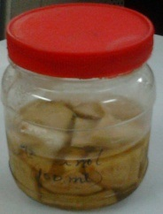
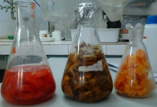
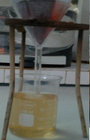
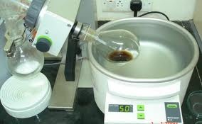
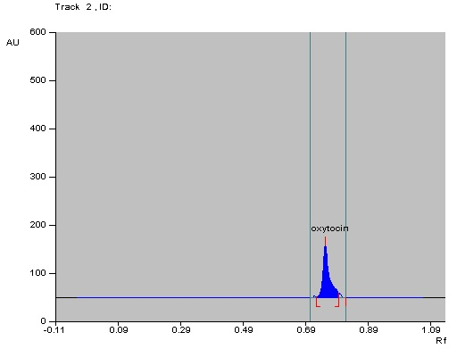
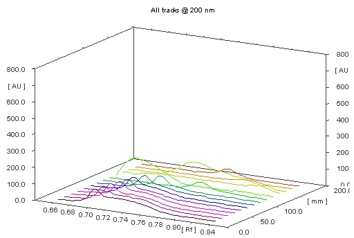
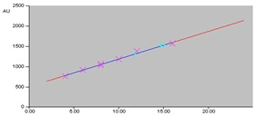
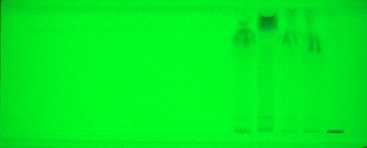
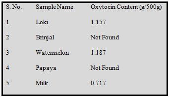

### Procedure

(a) Extraction of oxytocin from vegetables and fruit samples.

Extraction of oxytocin from different market available vegetables, fruits and milk samples were done by the method of cold percolation with sonication.

<table>
  <tr>
    <td>
      

        Samples collected from market were chopped into small pieces and these pieces were dipped into Methanol and left it over night.
      

    </td>
    <td width="150">
      
    </td>
  </tr>
  <tr>
    <td>
      

         The samples were then sonicated for 1hour
      

    </td>
    <td width="150">
      
    </td>
  </tr>
  <tr>
    <td>
      

       It is then filtered through watmann filter paper
      

    </td>
    <td width="150">
      
    </td>
  </tr>
  <tr>
    <td>
      

        The filtrate was concentrated using rotavapor
      

    </td>
    <td width="150">
      
    </td>
  </tr>
 
</table>
(b) Qualitative and quantitative analysis of caffeine

- The standard oxytocin solution was prepared by dissolving oxytocin (100 µg) in methanol (10 ml) in a volumetric flask. --The solution was sonicated for 10 minutes over an ultrasonic bath, to obtain a homogenous solution. Similarly, the crystalline oxytocin samples (extracted from vegetables/fruits/milk) were dissolved in methanol and then sonicated for 10 min.
- The solution was filtered through Whatman No. 41 filter paper and filtrate was used as sample solution.
- A 20cm × 10cm aluminium backed HPTLC plate coated with silica gel
60 F 254 (E. Merck, Darmstadt, Germany) was used for analysis. They were pre-washed with methanol and dried in an oven at 65oC for 10 minutes.
- The samples were applied at 10 mm from the base of HPTLC plate by means of a Camag (Switzerland) Linomat V sample applicator using a syringe (100µL, Hamilton, Bonaduz, Switzerland).
- A linear calibration curve was obtained on applying the increasing concentration of standard caffeine in the range (20-140 ng). Extracted samples (4.8 and 200 µg) from tea and coffee respectively were also loaded on the same plate.
- HPTLC analysis was performed on a computerized densitometer scanner 3, controlled by winCATS planar chromatography manager version 1.4.4. (CAMAG, Switzerland).
- Plate was developed to a distance of 80 mm, in a Camag twin-trough chamber with mobile phase toluene: acetone, 4:1 (v/v).
- Plates were evaluated by densitometry at 275 nm with a Camag Scanner 3 for quantification.

### Observation

Pre-coated silica gel HPTLC plates (60 F254) were used for the analysis of oxytocin content in different edible samples. The chromatographic profile of the sample was normal (well shaped), showing oxytocin as the main component (Fig. 4). Peak of oxytocin was identified using the solvent system as Methanol: Ammonia (pH 6.8) and there was no overlap with any other analyses of the sample. The chromatogram of oxytocin shown in fig. confirmed that standard oxytocin taken for study is pure.

Chromatographic Profile of Standard Oxytocin

3D view of Oxytocin Analysis

Linearity Curve for Oxytocin

Image of the plate for Accuracy at 254nm
Table: Oxytocin Levels in Samples

#### Linearity curve for oxytocin
Bands of oxytocin were separated well on HPTLC silica plates by using solvent system Methanol: Ammonia (pH 6.8). Oxytocin peaks were identified and showed Rf value of 0.71 ± 0.02. Oxytocin content in vegetables, fruits and milk was found to be in the range of 11.82-15.05 ng/spot selected for study (Table 5). Linearity for oxytocin was studied by taking concentrations 5ng to 25ng.

