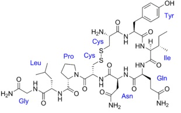

### Reagents

- Oxytocin standard
- Vegetables/fruits/milk samples
- Methanol
- Ammonia

All chemicals used in this study were of analytical grade.

### Theory

Food is the mixture of various essential substances. The best food is hygienic, digestible and well balanced in its constituents to furnish nourishments required by the living systems. Today many food items have been adulterated using several chemical substances or impurities that can cause severe damage to the living system. Oxytocin is one of the most frequently used adulterant for increasing the growth rate of vegetables, fruits and milk. Oxytocin is a synthetic octapeptide hormone naturally found in both sexes in animals. Oxytocin is chemically Hemi-cystinyl-tyrosyl-isoleucyl-glutaminyl-asparaginyl hemi-cystinyl-propyl-leucyl glycinamide also known as alpha-hypophamine [1].

  
  
Figure 1: structure of oxytocin

When excess of oxytocin is found to be present in edibles it may cause headache, nausea, abdominal pain, drowsiness, etc to the user [2-8]. Therefore, it is of great importance to develop a method for the analysis of oxytocin in edibles.
